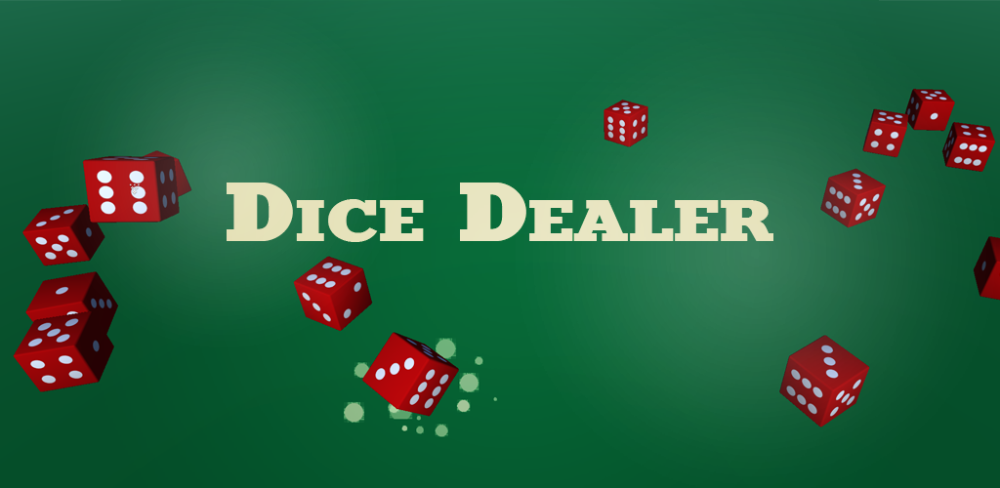

# Dice Dealer

<table>
    <tr>
        <td>When starting</td>
        <td>After buying some upgrades</td>
        <td>Increase your points by scoring with combi</td>
    </tr>
    <tr>
        <td></td>
        <td></td>
        <td></td>
    </tr>
</table>

 
 
Dice Dealer is an idle game about dice. As soon as a dice stops, you earn points. From these points you can buy improvements for the automatic insertion of dice.  

Shake your smartphone, ...  
    - ... to get more points!  
    - ... to get even more points by achieving combos!  
    - ... to automate the insertion of dice!  
    - ... and become the queen or king of dice!  

Get started and become the goddess or god of dice among your friends by getting the most points. The more dice you have on the field at the same time, the more points you get from combos.  

You can download the game on  
https://play.google.com/store/apps/details?id=de.DiceDealerCompany.DiceDealer  

## Background  
Dice Dealer is a mobile application for Android and was developed during the first semester of the games master at the Hamburg University of Apllied Sciences. The objection was to implementing a game with a simple mechanic using one of the sensors provided by a smartphone. We chose the acceleration sensor to detect the shaking of a smartphone.  

If you have questions or want to report a bug, please send an email to tobiasfox@gmx.net.